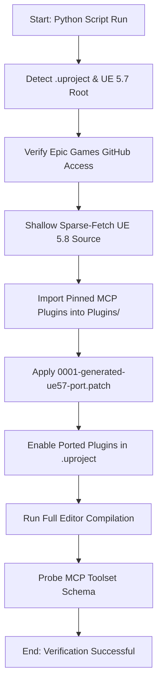

# UE 5.7 MCP PortKit

[](https://www.unrealengine.com/)
[-orange.svg)](https://github.com/EpicGames/UnrealEngine)

An automated utility and patch kit to backport Unreal Engine 5.8 Model Context Protocol (MCP) editor toolsets to Unreal Engine 5.7 projects.

This kit does not vendor Unreal Engine source code. Instead, it securely sparse-fetches the pinned UE 5.8 source code from your licensed Epic Games GitHub repository, ports the plugins directly into your project's local directory, applies a pre-configured compatibility patch, builds the target, and verifies the schema.

---

## Technical Overview & Installation Flow

The installer performs environment detection, handles authentication, clones only the necessary source trees, runs source refactoring to fit UE 5.7, compiles, and registers the ported MCP tools.



---

## Key CLI Commands

Run these commands inside the `Scripts/ModelContextProtocolPort` directory:

| Command | Action / Behavior |
| :--- | :--- |
| **`python mcp_port_kit.py install`** | Main entrypoint. Performs environment checks, fetches UE 5.8 code, applies patches, enables plugins, and builds/verifies target. |
| **`python mcp_port_kit.py create-patch`** | Generates a new `0001-generated-ue57-port.patch` reflecting modifications made to the ported plugins inside your project. |
| **`python mcp_port_kit.py doctor`** | Checks local environment status, verifies plugin registry, and validates the MCP schema output. |
| **`python mcp_port_kit.py license-audit`** | Audit tool to verify Epic Games licensing guidelines are respected and no proprietary code is exposed. |
| **`python mcp_port_kit.py clean`** | Purges intermediate build files, cache, and temporary sparse-checkout source files. |

---

## Available MCP Toolset Coverage

The PortKit provides access to **414 sub-tools** across **40 registered toolsets** (pinned to UE 5.8.0-release). 

### High-Level Summary

| Toolset Group | Purpose / Scope | Available Tools |
| :--- | :--- | ---: |
| **EditorToolset** | Actors, Assets, Blueprints, Materials, Textures, Tables, Logs, Scene, etc. | 251 |
| **PCG & Spatial** | Procedural Content Generation and Spatial Queries | 31 |
| **Physics** | Colliders, Trace, Raycast, and Physics Queries | 17 |
| **Plugins** | Module state tracking, load/unload, and registry queries | 17 |
| **Slate Inspector** | UI composition, widget tracking, hierarchy inspector | 14 |
| **GAS (Gameplay Ability System)** | Abilities, Attributes, and Gameplay Effect management | 14 |
| **StateTree** | StateTree configuration, evaluation, and debug commands | 9 |
| **Config Settings** | Project config, ini overrides, and runtime settings | 8 |
| **AI Module** | Behavior Trees, AI Controllers, NavMesh queries | 7 |
| **Automation Tests** | Test discovery, runner controls, and test result logging | 7 |
| **Niagara** | Particle system configuration (Safe subset) | 7 |
| **Gameplay Tags** | Tag container search, hierarchy audits, tag additions | 6 |
| **Others** | Niagara, Conversation, DataRegistry, GameFeatures, LiveCoding, WorldConditions | 27 |

<details>
<summary>🔍 Click to expand full toolset registration matrix (40 Toolsets)</summary>

### Detailed Toolset Matrix

Here is the exact list of the 40 toolsets registered and verified by the PortKit:

| Group Name | Toolset Name | Port Coverage / Count | Status |
| :--- | :--- | :---: | :---: |
| **AIModuleToolset** | `BehaviorTreeTools` | 7 / 7 | 🟢 Complete |
| **AutomationTestToolset** | `AutomationTestToolset` | 7 / 7 | 🟢 Complete |
| **ConfigSettingsToolset** | `ConfigSettingsToolset` | 8 / 8 | 🟢 Complete |
| **ConversationToolset** | `ConversationTools` | 7 / 7 | 🟢 Complete |
| **DataRegistryToolset** | `DataRegistryTools` | 7 / 7 | 🟢 Complete |
| **EditorToolset** | `ActorTools` | 17 / 17 | 🟢 Complete |
| | `AssetTools` | 21 / 21 | 🟢 Complete |
| | `BlueprintTools` | 53 / 53 | 🟢 Complete |
| | `CurveTableTools` | 9 / 9 | 🟢 Complete |
| | `DataAssetTools` | 1 / 1 | 🟢 Complete |
| | `DataTableTools` | 10 / 10 | 🟢 Complete |
| | `EditorAppToolset` | 21 / 21 | 🟢 Complete |
| | `LogsToolset` | 4 / 4 | 🟢 Complete |
| | `MaterialInstanceTools` | 13 / 13 | 🟢 Complete |
| | `MaterialTools` | 22 / 22 | 🟢 Complete |
| | `ObjectTools` | 6 / 6 | 🟢 Complete |
| | `PrimitiveTools` | 4 / 4 | 🟢 Complete |
| | `ProgrammaticToolset` | 2 / 2 | 🟢 Complete |
| | `SceneTools` | 20 / 20 | 🟢 Complete |
| | `SkeletalMeshTools` | 22 / 22 | 🟢 Complete |
| | `StaticMeshTools` | 16 / 16 | 🟢 Complete |
| | `StringTableTools` | 8 / 8 | 🟢 Complete |
| | `TextureTools` | 2 / 2 | 🟢 Complete |
| **GameFeaturesToolset** | `GameFeaturesToolset` | 7 / 7 | 🟢 Complete |
| **GameplayTagsToolset** | `GameplayTagsToolset` | 6 / 6 | 🟢 Complete |
| **GASToolsets** | `AbilitySystemInspectorToolset` | 4 / 4 | 🟢 Complete |
| | `AttributeSetToolset` | 2 / 2 | 🟢 Complete |
| | `GameplayCueToolset` | 8 / 8 | 🟢 Complete |
| **LiveCodingToolset** | `LiveCodingToolset` | 1 / 1 | 🟢 Complete |
| **NiagaraToolsets** | `NiagaraToolset_Assets` | 3 / 3 | 🟢 Complete |
| | `NiagaraToolset_Blueprint` | 2 / 2 | 🟢 Complete |
| | `NiagaraToolset_Info` | 1 / 1 | 🟢 Complete |
| **PCGToolset** | `PCGSpatialToolset` | 1 / 1 | 🟢 Complete |
| | `PCGToolset` | 30 / 30 | 🟢 Complete |
| **PhysicsToolsets** | `PhysicsAssetToolset` | 17 / 17 | 🟢 Complete |
| **PluginToolset** | `PluginToolset` | 17 / 17 | 🟢 Complete |
| **SlateInspectorToolset** | `SlateInspectorToolset` | 14 / 14 | 🟢 Complete |
| **StateTreeToolset** | `StateTreeToolset` | 9 / 9 | 🟢 Complete |
| **WorldConditionsToolset**| `WorldConditionsToolset` | 2 / 2 | 🟢 Complete |
| **ToolsetRegistry** | `ToolsetRegistry` | 4 / 4 | 🟢 Complete |

</details>

---

## Prerequisites & Requirements

- **Operating System:** Windows (with Developer Mode recommended for symlinks).
- **Python:** Version 3.10 or higher.
- **Git Client:** Configured with credentials that have read access to [EpicGames/UnrealEngine](https://github.com/EpicGames/UnrealEngine) on GitHub.
- **Project Structure:** A standard C++ project with a valid `.uproject` file on Unreal Engine 5.7.

---

## Installation

### 1. Add as a Git Submodule
From your project's root folder:
```powershell
git submodule add https://github.com/MC-Oruc/UE57-MCP-PortKit.git Scripts/ModelContextProtocolPort
```

### 2. Run the Installer
```powershell
python Scripts/ModelContextProtocolPort/mcp_port_kit.py install
```
This script will fetch Epic Engine sources, port the plugins, patch incompatibilities, modify your `.uproject`, compile your Editor target, and print validation outputs.

---

## Customizing and Updating the Port Patch

If you modify the C++ code inside the ported plugins under `Plugins/` (for example, to resolve engine API changes or add custom tools), you can regenerate the compatibility patch using:

```powershell
python Scripts/ModelContextProtocolPort/mcp_port_kit.py create-patch
```

This creates/updates the patch at:
`Scripts/ModelContextProtocolPort/patches/0001-generated-ue57-port.patch`

You can then commit and push this updated patch inside the submodule.

---

## License & Compliance

- This PortKit **does not vendor** proprietary Epic Games code.
- Epics' IP is fetched directly from the user's licensed GitHub repository during setup.
- Generated code and configuration remain local and respect Epic Games' EULA guidelines.
